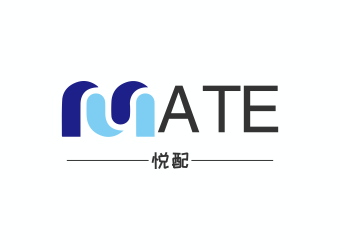

<h1 align=center>
  	悦配MATE-伙伴匹配系统
</h1>

<a target="_blank" href="https://github.com/Gumengyo/yuepei-backend">
    	</img>
		</img>
        </img>
        </img>
        </img>
		</img>
        </img>
        </img>
		</img>
		</img>
		</img>
</a>

## 1、项目介绍

悦配 MATE 是一个基于 Vue3 + Spring Boot + Redis + MySQL 移动端的交友平台，使用**WebSocket**实现实时通信，实现了用户登录、按标签检索用户、推荐相似用户、组队、聊天、点赞、评论等功能。

👉[接口文档📄](./doc/接口文档.md)

## 2、在线体验

 演示地址: http://yp.gumengyo.top

本站旨在辅助您找到志同道合的伙伴，解决您工作和学习中遇到的问题。为了维护互联网安全和健康发展，以及保障您的个人权益，我们郑重提醒您：您在使用本服务时，必须以善意且谨慎的态度行事；不得利用本服务故意或者过失的从事危害国家安全和社会公共利益、扰乱经济秩序和社会秩序、侵犯他人合法权益等法律、行政法规禁止的活动，请勿输入、生成并发布、输出、传播涉及国家法律法规内容。

可以使用邮箱注册账号体验，不想注册的，可以使用以下账号直接登录：

账号：user

密码：123456789

## 3、项目背景

伙伴匹配系统旨在帮助你更轻松地找到与你相匹配的伙伴，无论是结交新朋友、寻找共同的兴趣伙伴还是寻找潜在的合作伙伴。它可以节省你的时间和精力，让你更快地连接到与你有共同兴趣和目标的人。帮助你找到理想的队友，组建队伍，一起实现共同目标。

## 4、核心功能

1. 用户注册和登录：用户可以通过注册账号并登录使用该网站。
2. 标签匹配：用户可以选择自己的技能和需求标签，系统会根据标签匹配合适的队友。
3. 组队功能：用户可以与其他用户组建队伍，一起参加编程比赛。
4. 帖文发布、点赞和关注：用户可以发布自己的帖文，其他用户可以对其进行点赞和关注，以便更好地了解和交流。
5. 实时聊天：队伍中的用户可以进行实时聊天，方便沟通和协作。

## 5、项目亮点

1. 使用 Redis 实现分布式 Session 登录，成功解决了集群间登录状态同步问题。
2. 对于项目中复杂的集合处理（比如为队伍列表关联已加入队伍的用户），使用 Java 8 Stream API 和 Lambda 表达式来简化编码。
3. 使用 Redis 缓存首页高频访问的用户信息列表，将接口响应时长从 12520ms缩短至400ms。且通过自定义 Redis 序列化器来解决数据乱码、空间浪费的问题。
4. 为解决首次访问系统的用户主页加载过慢的问题，使用 Spring Scheduler 定时任务来实现缓存预热，并通过分布式锁保证多机部署时定时任务不会重复执行。
5. 为解决同一用户重复加入队伍、入队人数超限的问题，使用 Redisson 分布式锁来实现操作互斥，保证了接口幂等性。
6. 使用余弦相似度算法实现了根据标签匹配最相似用户的功能，并通过 Redis ZSet 来减少 TOP N 运算过程中的内存占用。
7. 自主编写 Dockerfile，并通过第三方容器托管平台实现自动化镜像构建及容器部署，提高部署上线效率。
8. 使用 Knife4j + Swagger 自动生成后端接口文档，并通过编写 ApiOperation 等注解补充接口注释，避免了人工编写维护文档的麻烦。
9. 使用本地+云服务储存用户头像，并自定义cdn加速域名指向项目专用储存空间。
10. 实现了基于 WebSocket 的实时聊天功能，用于用户之间的即时通信和信息交流。通过建立双向通信连接，支持实时消息的发送和接收。
11. 基于推模式实现关注 Feed 流，确保新文章消息的及时可达，并减少用户访问的等待时间。
12. 实现了高效可靠的点赞功能，利用 Redis 缓存和有序集合实现点赞计数和点赞排序，相较于传统 DB 操作，性能提升了20%。
13. 使用 FreeMarker 生成邮件内容，定时发送邮件通知给收到评论的用户，使用 Redisson 分布式锁确保唯一执行，处理并发和分布式环境下的能力。
14. 前端使用 Vant UI 组件库，并封装了全局通用的 Layout 组件，使主页、搜索页、组队页布局一致、并减少重复代码。
15. 基于 Vue Router 全局路由守卫实现了根据不同页面来动态切换导航栏标题， 并通过在全局路由配置文件扩展 title 字段来减少无意义的 if else 代码。
16. 使用component is标签自定义少数页面的基本布局，优化用户体验。
17. 封装前端卡片组件，对数据做统一处理，减少重复代码。

## 6、技术选型

**前端**

- Vue3

- Vite

- Vant

- Axios

**后端**

- SpringBoot 

- MySQL

- Mybatis-Plus

- Mybatis X

- Redis

- Redisson

- Spring Scheduler 定时任务

- Swagger + Knife4j

- Gson

- 余弦相似度匹配算法

- WebSocket
